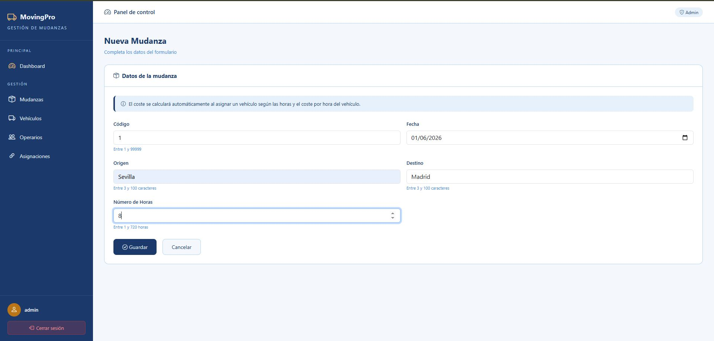
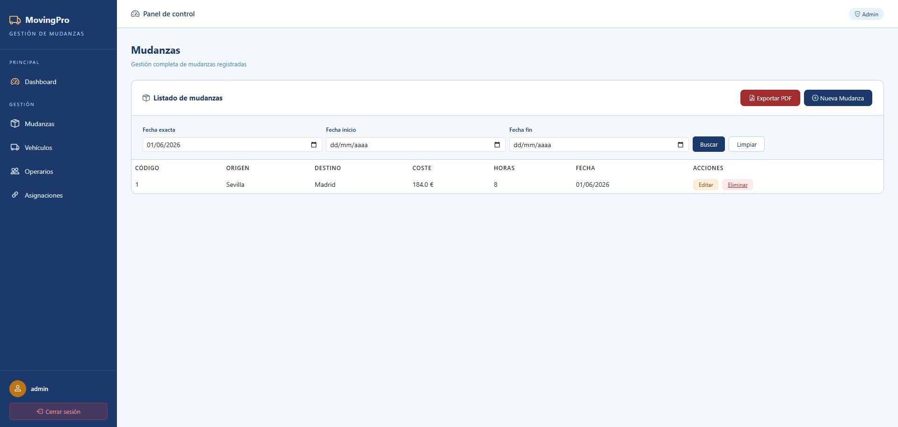
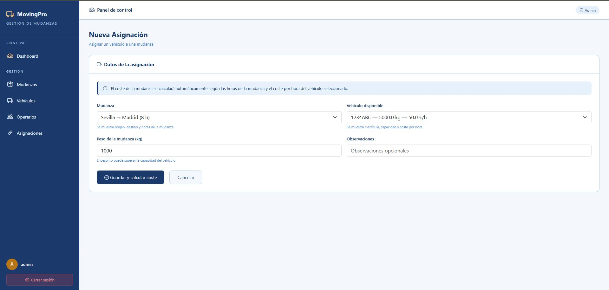

# MovingPro

Aplicación web para la gestión integral de mudanzas desarrollada con Spring Boot y Thymeleaf.

## Estado del proyecto


## Descripcion

MovingPro permite a una empresa de mudanzas gestionar de forma completa todas sus operaciones diarias. El sistema centraliza la informacion de mudanzas, vehiculos y operarios en una unica plataforma web accesible desde cualquier dispositivo.

Funcionalidades principales:

- Registro y seguimiento de mudanzas con busqueda por fecha
- Control de flota de vehiculos y disponibilidad en tiempo real
- Gestion del equipo de operarios
- Asignacion de vehiculos a mudanzas con calculo automatico de coste
- Control de estados EN_ORIGEN, EN_RUTA, EN_DESTINO, TERMINADO
- Dashboard con estadisticas avanzadas
- Exportacion de listados a PDF con filtros de fecha
- Diseno responsive para moviles

## Capturas





## Navegacion rapida

- [Controladores](src/main/java/com/salesianostriana/dam/movingprobeta/controller)
- [Servicios](src/main/java/com/salesianostriana/dam/movingprobeta/service)
- [Repositorios](src/main/java/com/salesianostriana/dam/movingprobeta/repository)
- [Entidades](src/main/java/com/salesianostriana/dam/movingprobeta/model)
- [Seguridad](src/main/java/com/salesianostriana/dam/movingprobeta/security)
- [Templates](src/main/resources/templates)
- [CSS](src/main/resources/static/css)

## Tecnologias

| Tecnologia | Version | Uso |
|-----------|---------|-----|
| Java | 21 | Lenguaje principal |
| Spring Boot | 4.0.6 | Framework backend |
| Spring Security | 7.0.5 | Autenticacion y autorizacion |
| Spring Data JPA | - | Persistencia de datos |
| Hibernate | 7.2.12 | ORM |
| H2 Database | - | Base de datos en memoria |
| Thymeleaf | 3.1.5 | Motor de plantillas |
| Bootstrap | 5.3.0 | Framework CSS |
| Bootstrap Icons | 1.11.0 | Iconos |
| iTextPDF | 5.5.13.3 | Generacion de PDFs |
| Lombok | - | Reduccion de boilerplate |

## Como arrancar

1. Clona el repositorio

```bash
git clone https://github.com/garciamaalb25-lang/MovingProBeta.git
```

2. Abre el proyecto en Spring Tool Suite

3. Clic derecho sobre el proyecto → Run As → Spring Boot App

4. Abre el navegador en
http://localhost:9000

## Usuarios por defecto

| Usuario | Contrasena | Rol |
|---------|-----------|-----|
| admin | admin | ADMIN |
| user | user | OPERADOR |

## Roles y permisos

| Accion | ADMIN | OPERADOR |
|--------|-------|----------|
| Ver mudanzas | Si | Si |
| Crear mudanzas | Si | Si |
| Editar mudanzas | Si | No |
| Eliminar mudanzas | Si | No |
| Ver vehiculos | Si | Si |
| Crear vehiculos | Si | Si |
| Editar vehiculos | Si | No |
| Eliminar vehiculos | Si | No |
| Ver operarios | Si | Si |
| Crear operarios | Si | No |
| Editar operarios | Si | No |
| Eliminar operarios | Si | No |
| Crear asignaciones | Si | Si |
| Eliminar asignaciones | Si | No |

## Estructura del proyecto
```
src/main/java/com/salesianostriana/dam/movingprobeta/
├── controller/          # Controladores Spring MVC
├── exception/           # Excepciones personalizadas
├── model/               # Entidades JPA
├── repository/          # Repositorios Spring Data
├── security/            # Configuracion de seguridad
├── service/             # Logica de negocio
└── usuario/             # Modelo de usuario y autenticacion

src/main/resources/
├── static/css/          # Estilos CSS
├── templates/           # Plantillas Thymeleaf
│   ├── fragments/       # Sidebar y navbar reutilizables
│   ├── mudanza/         # Vistas de mudanzas
│   ├── vehiculo/        # Vistas de vehiculos
│   ├── operario/        # Vistas de operarios
│   └── mudanzavehiculo/ # Vistas de asignaciones
└── application.properties
```

## Decisiones tecnicas

### Calculo automatico de coste
Al asignar un vehiculo a una mudanza el coste se calcula automaticamente:
coste = numeroHoras x costePorHora

### Control de estados
Las asignaciones tienen un ciclo de vida con 4 estados:
EN_ORIGEN → EN_RUTA → EN_DESTINO → TERMINADO
Al marcar como TERMINADO el vehiculo queda disponible automaticamente.

### Excepciones personalizadas
5 excepciones gestionadas por @ControllerAdvice:
- [CapacidadExcedidaException](src/main/java/com/salesianostriana/dam/movingprobeta/exception/CapacidadExcedidaException.java)
- [VehiculoNoDisponibleException](src/main/java/com/salesianostriana/dam/movingprobeta/exception/VehiculoNoDisponibleException.java)
- [MudanzaNotFoundException](src/main/java/com/salesianostriana/dam/movingprobeta/exception/MudanzaNotFoundException.java)
- [OperarioNotFoundException](src/main/java/com/salesianostriana/dam/movingprobeta/exception/OperarioNotFoundException.java)
- [VehiculoNotFoundException](src/main/java/com/salesianostriana/dam/movingprobeta/exception/VehiculoNotFoundException.java)

## Funcionalidades adicionales

1. Exportacion a PDF con filtros de fecha activos
2. Estadisticas avanzadas en dashboard con Streams y Lambdas

## Autor

Alberto Garcia Martinez — 1 DAM — Salesianos Triana — 2025/2026
